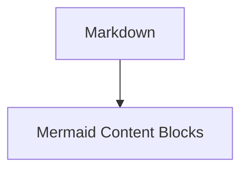

# Markdown Importer Blocks

[](https://github.com/Monotoba/markdown-importer-blocks/actions/workflows/test.yml)
[](LICENSE)
[](https://wordpress.org)
[](https://www.php.net)

A WordPress block plugin for importing and rendering Markdown content with optional delegation to specialized content plugins.

**Core plugin of a cohesive system:** **Markdown Importer** + [Code Content Blocks](https://github.com/Monotoba/code-content-blocks) + [Math Content Blocks](https://github.com/Monotoba/math-content-blocks) + [Mermaid Content Blocks](https://github.com/Monotoba/Mermaid-WP-Block).

### Use Standalone or as a Cohesive Unit

**As a Standalone Plugin:**
- Import and render Markdown without external dependencies
- All content renders as semantic WordPress HTML
- Perfect for simple Markdown-to-WordPress workflows

**As a Cohesive System (Recommended):**
Activate the companion plugins for specialized rendering:
- **[Code Content Blocks](https://github.com/Monotoba/code-content-blocks)** → Syntax-highlighted code with 80+ languages
- **[Math Content Blocks](https://github.com/Monotoba/math-content-blocks)** → Professional formulas (TeX, AsciiMath, MathML)
- **[Mermaid Content Blocks](https://github.com/Monotoba/Mermaid-WP-Block)** → Diagrams, flowcharts, and sequence diagrams

When companions are active, Markdown Importer automatically detects them and delegates specialized content for optimal rendering and live editing.

---

The plugin adds a **Markdown Importer** block that lets an editor:

- paste Markdown directly into the block;
- load a local `.md`, `.markdown`, `.mdown`, `.mkd`, or `.txt` file in the browser;
- import Markdown from a remote HTTP/HTTPS URL through an authenticated WordPress REST endpoint;
- render the Markdown as normal WordPress HTML on the frontend;
- delegate diagrams to **Mermaid Content Blocks** when available;
- delegate formulas to **Math Content Blocks** when available;
- delegate fenced code blocks to **Code Content Blocks** when available;
- copy the converted HTML; or
- replace the importer with WordPress blocks.

The block is dynamic while in display mode: the saved Markdown remains editable, and the frontend HTML is produced by the plugin renderer.

## Requirements

- WordPress 7.0 or newer
- PHP 8.0 or newer
- A user role that can edit posts for REST preview/import actions
- Optional companion plugins:
  - **Mermaid Content Blocks** for rendered Mermaid diagrams
  - **Math Content Blocks** for rendered TeX/LaTeX, AsciiMath, and MathML
  - **Code Content Blocks** for syntax-highlighted code fences

## Installation

1. Download the source from this repository and zip the `markdown-importer-blocks` folder. A tested installable release ZIP will be provided on the [releases page](https://github.com/Monotoba/markdown-importer-blocks/releases) when available.
2. In WordPress, go to **Plugins → Add New → Upload Plugin**.
3. Upload the ZIP and activate it.
4. Open the block editor and insert **Markdown Importer**.
5. Install and activate the companion plugins you want to delegate to.

## Usage

### Paste Markdown

Select **Paste text** as the source, then type or paste Markdown into the editor textarea.

### Upload a Markdown file

Select **Upload file** and choose a Markdown/text file. The file is read locally by the browser and copied into the block. It is not uploaded to the Media Library.

### Import a Markdown URL

Select **Import from URL**, enter a public HTTP/HTTPS URL, and click **Import URL into block**. The server fetches the URL through an authenticated REST endpoint and stores the returned Markdown in the block.

For safety, local/private network URLs are blocked, only `http` and `https` schemes are allowed, redirects are limited, and the maximum response size is 1 MiB.

### Display vs. convert

- **Display mode** keeps the Markdown editable and dynamically renders HTML on the frontend.
- **Convert mode** uses **Replace with WordPress blocks**.
  - Ordinary Markdown sections become static Custom HTML blocks.
  - Fenced Mermaid sections become `mcb/mermaid` blocks when Mermaid Content Blocks is active.
  - Fenced math sections become `mcb/math` blocks when Math Content Blocks is active.
  - Fenced code sections become `mcb/code` blocks when Code Content Blocks is active.
  - If a companion block is not active, the section becomes compatible HTML fallback instead.

## Companion plugin integration

This plugin intentionally does not bundle Mermaid, MathJax, or Highlight.js. It emits markup compatible with the companion plugins and enqueues those plugins' registered assets when they are active.

### Code fences

Ordinary fenced code:

````markdown
```python {1,3-4}
def hello(name: str) -> str:
    return f"Hello, {name}"
```
````

In display mode, the renderer emits Code Content Blocks-compatible markup:

```html
<figure class="mcb-code-block ccb-code-block" data-mcb-code-block="1">
```

When Code Content Blocks is active, it syntax-highlights the block. The Markdown block also exposes global code settings for light/dark/system theme, line numbers, wrapping, and copy buttons.

### Mermaid fences

````markdown

````

In display mode, those fences are emitted using the same `.mcb-mermaid-block` markup used by Mermaid Content Blocks. If Mermaid Content Blocks is active, this plugin enqueues its renderer and the diagram renders through the shared loader.

Supported Mermaid theme names are `default`, `neutral`, `dark`, `forest`, and `base`.

### Math formulas

The Markdown importer now supports these delegated math forms:

```markdown
Inline TeX: $a^2 + b^2 = c^2$
Inline TeX: \(e^{i\pi} + 1 = 0\)

$$
\frac{-b \pm \sqrt{b^2 - 4ac}}{2a}
$$

\[
\int_0^1 x^2\,dx = \frac{1}{3}
\]
```

Fenced math:

````markdown
```tex
\sum_{i=1}^{n} i = \frac{n(n+1)}{2}
```

```asciimath
sum_(i=1)^n i = (n(n+1))/2
```

```mathml
<math>
  <mrow><mi>x</mi><mo>=</mo><mn>1</mn></mrow>
</math>
```
````

Raw MathML blocks beginning with `<math>` are also delegated to Math Content Blocks. Variable color rules can be entered in the Markdown block settings and are passed to Math Content Blocks.

Example variable colors:

```text
x = #d32f2f
y = #1976d2
\alpha = purple
```

## Supported Markdown subset

The included no-dependency parser supports a practical Markdown subset:

- ATX headings, `#` through `######`
- paragraphs
- unordered and ordered lists
- blockquotes
- horizontal rules
- fenced code blocks with Code Content Blocks compatibility
- Mermaid fenced code integration with Mermaid Content Blocks
- TeX/LaTeX, AsciiMath, and MathML integration with Math Content Blocks
- inline code
- strong/emphasis/strikethrough
- links
- images
- GitHub-style pipe tables

The parser is intentionally conservative. If you need full CommonMark/GFM compliance later, replace `includes/class-markdown-parser.php` with a well-maintained parser and keep the same `Markdown_Parser::render()` interface.

## Security notes

- Markdown is converted server-side and filtered through a WordPress KSES allowlist.
- Raw HTML from Markdown is disabled by default.
- If raw HTML is enabled, output still passes through WordPress post-content sanitization.
- Remote URL import is only available to logged-in users who can edit posts.
- Remote URL import blocks private/local hosts and private/reserved IP ranges to reduce SSRF risk.
- Remote fetches use `wp_safe_remote_get()` and a 1 MiB response limit.
- Mermaid, math, and code rendering are delegated to companion plugins so their security and rendering settings stay centralized.

## Testing

From the plugin folder:

```bash
./tests/smoke.sh
```

The smoke test checks PHP syntax, JavaScript syntax, `block.json`, and parser output for Markdown, code, Mermaid, and math compatibility fixtures.

## Companion Plugin Integration Details

All companion plugins are optional, but when installed and active, they provide seamless delegation:

### When Code Content Blocks is active:
- Fenced code blocks in Markdown automatically syntax-highlight
- Global code theme setting applies to all code in imported Markdown
- Line numbers, copy button, and wrapping preferences sync automatically

### When Math Content Blocks is active:
- Inline math (`$...$`, `\(...\)`) and display math (`$$...$$`, `\[...\]`) render beautifully
- Fenced math blocks become interactive formula blocks
- Variable color rules apply consistently across all formulas

### When Mermaid Content Blocks is active:
- Mermaid fenced blocks become interactive diagrams
- Theme settings sync to diagram rendering
- Live preview available in the editor

## Related Plugins

- **[Code Content Blocks](https://github.com/Monotoba/code-content-blocks)** – Syntax-highlighted code blocks with 80+ languages
- **[Math Content Blocks](https://github.com/Monotoba/math-content-blocks)** – Render mathematical formulas (TeX, AsciiMath, MathML)
- **[Mermaid Content Blocks](https://github.com/Monotoba/Mermaid-WP-Block)** – Create diagrams and flowcharts

Install any or all to extend Markdown Importer, or use Markdown Importer standalone.

## License

MIT. See `LICENSE`.
